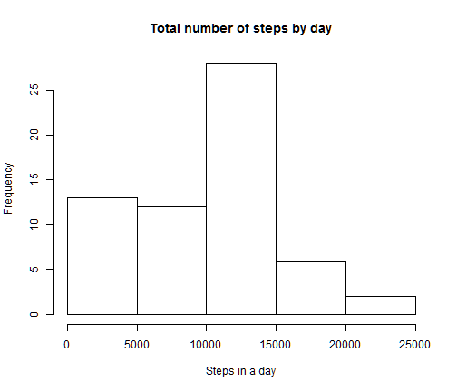
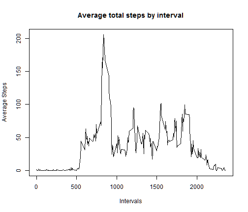
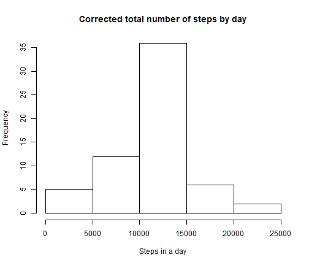

#Reproducibility: Course Project 1 

###Loading and preprocessing the data
Loading the library and setting local language


```r
library(ggplot2)
Sys.setlocale("LC_TIME","English")
```

```
## [1] "English_United States.1252"
```

Reading and loading the data


```r
activityData <- read.csv(file = "activity.csv", header = TRUE, sep = ",")
```

###What is mean total number og steps taken per day?
Calculated the total number of steps taken per day and presenting it in a
histogram

```r
StepsDaily <- split(activityData$steps,activityData$date)
	DailySum <- sapply(StepsDaily, sum, na.rm = TRUE)
```

```r
	hist(DailySum, main = "Total number of steps by day",
	     xlab = "Steps in a day")
```



Then the means and the median were found taken a summary of the database

```r
summary(DailySum)
```

```
##    Min. 1st Qu.  Median    Mean 3rd Qu.    Max. 
##       0    6778   10400    9354   12810   21190
```

###What is the average daily actvitiy pattern?
This was done using the average by the interval 

```r
StepsbyInterval <- split(activityData$steps,activityData$interval)
	IntervalMean <- sapply(StepsbyInterval,mean, na.rm = TRUE)
	Intervals <- as.integer(names(IntervalMean))
	IntervalMeanTable <- as.data.frame(cbind(Intervals, IntervalMean),
	                                   row.names = FALSE)
```

This was plotted using the base plotting system.

```r
plot(Intervals, IntervalMean, ylab = "Average Steps", 
		 main = "Average total steps by interval", type = "l")
```



The 5 minute interval total average, over all the days, was found as below.

```r
Intervals[which.max(IntervalMean)]
```

```
## [1] 835
```

###Imputing missing values
Calculate and report the total number of missing values in the dataset
(i.e. the total number of rows with NAs)

```r
NAlogical <- is.na(activityData$steps)
NACount <- sum(as.integer(NAlogical))
```

The strategy for filling in all of the missing values in the dataset, was to 
 use the mean for that 5-minute interval obtained over all days. This was done
 by looping through the entire dataset and if the values was NA, the previous
 data calculated for that interval was used. 

```r
NoNAData <- activityData
for (i in 1:nrow(NoNAData)){
	row <- NoNAData[i,"steps"]
	if (is.na(row) == TRUE){
		# Finding intervals mean for current interval
		interval <- NoNAData[i, "interval"]
		IntPosition <- match(interval, IntervalMeanTable[,"Intervals"])
		steps <- IntervalMeanTable[IntPosition,"IntervalMean"]
		# Assigning mean interval to current row
		NoNAData[i,"steps"] <- steps
	}
}
```

Make a histogram of the total number of steps taken each day

```r
NoNAStepsDaily <- split(NoNAData$steps, NoNAData$date)
NoNADailySum <- sapply(NoNAStepsDaily, sum, na.rm = TRUE)
```

```r
hist(NoNADailySum, main = "Corrected total number of steps by day", 
     xlab = "Steps in a day")
```



Thus, summary was used to find the mean and median total number of steps
taken per day. 

```r
summary(NoNADailySum)
```

```
##    Min. 1st Qu.  Median    Mean 3rd Qu.    Max. 
##      41    9819   10770   10770   12810   21190
```

The values of the corrected data using the correcting data causes there to be
more days that had over 10,000 steps. In other words, the total number of steps
number of overall steps.

###Are there differences in activity patterns between weekdays and weekends?

Create a new factor variable in the dataset with two levels - "weekday" and
"weekend" indicating whether a given date is a weekday or weekend day.

```r
Dates <- as.Date(NoNAData$date,origin = "%Y-%m-%d")
	Days <- weekdays(Dates)
	WeekdayLogical <- grepl(pattern = c("Saturday|Sunday"),x = Days)
	WeekdayIndicator <- as.factor(ifelse(WeekdayLogical == TRUE, 
	                                     "Weekend", "Weekday"))
	NoNAData <- cbind(NoNAData,WeekdayIndicator)
```

Make a panel plot containing a time series plot (i.e. type = "l") of the
5-minute interval (x-axis) and the average number of steps taken, averaged 
across all weekday days or weekend days (y-axis).

Compling Data for the plot.

```r
FinalData <- aggregate(steps ~ interval + WeekdayIndicator, NoNAData, mean)
```

Creating and Saving plots

```r
qplot(interval, steps, data = FinalData, type = 'l', geom=c("line"),
      xlab = "Interval", ylab = "Number of steps")+ facet_wrap(~ WeekdayIndicator, ncol = 1)		  
```


